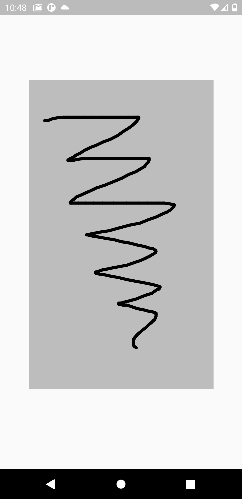

<!-- 
This README describes the package. If you publish this package to pub.dev,
this README's contents appear on the landing page for your package.

For information about how to write a good package README, see the guide for
[writing package pages](https://dart.dev/guides/libraries/writing-package-pages). 

For general information about developing packages, see the Dart guide for
[creating packages](https://dart.dev/guides/libraries/create-library-packages)
and the Flutter guide for
[developing packages and plugins](https://flutter.dev/developing-packages). 
-->

# Flutter Painting Tools

A simple usage flutter library that allows the user to paint on the screen.

## Installing

TODO: Implement installing guide.

## Getting started

TODO: Implement getting started.

## Basic Usage

This package is very easy to use.

For a basic usage you can just show a simple board on the screen where the user can paint, by displaying a ```PaintingBoard``` in your code.

For example:

```dart
Center(
    child: PaintingBoard(
        boardHeight: 500,
        boardWidth: 300,
    ),
)
```

Which will produce an output like this:



You can customize your ```PaintingBoard``` how much do you want by changing its parameters 

| Parameter                  | Type                           | Meaning                                                                                    | Default Value         |
| -------------------------- | ------------------------------ | ------------------------------------------------------------------------------------------ | --------------------- |
| ```boardHeight```          | ```double```                   | The height of the ```PaintingBoard```                                                      | ```double.infinity``` |
| ```boardWidth```           | ```double```                   | The width of the ```PaintingBoard```                                                       | ```double.infinity``` |
| ```boardbackgroundColor``` | ```Color?```                   | The background color of the ```PaintingBoard```                                            | ```Colors.grey```     |
| ```boardDecoration```      | ```BoxDecoration?```           | The decoration of the ```PaintingBoard```                                                  | ```null```            |
| ```controller```           | ```PaintingBoardController?``` | The controller used to manage advanced task of the ```PaintingBoard``` (explained further) | ```null```            |

## Advanced Usage

### Setting up the controller

If you want do perform advanced task, such as paint with different colors, delete the painting, ecc. you need to set up a ```PaintingBoardController```.

1. Declare the ```PaintingBoardController```

    ```dart
    late final PaintingBoardController controller;
    ```
2. Allocate the ```PaintingBoardController``` inside the ```initState()``` method of your ```StatefulWidget```

    ```dart
    @override
    void initState() {
        controller = PaintingBoardController();
        super.initState();
    }
    ```
3. Remember to dispose the  ```PaintingBoardController``` inside the ```dispose()``` method of your ```StatefulWidget```

    ```dart
    @override
    void dispose() {
        controller.dispose();
        super.dispose();
    }
    ```
4. Pass the  ```PaintingBoardController``` to the ```controller``` property of the ```PaintingBoard```

    ```dart
    PaintingBoard(
        boardHeight: 500,
        boardWidth: 300,
        boardBackgroundColor: Colors.grey[400],
        controller: controller,
    )
    ```

## Additional information

TODO: Tell users more about the package: where to find more information, how to 
contribute to the package, how to file issues, what response they can expect 
from the package authors, and more.
